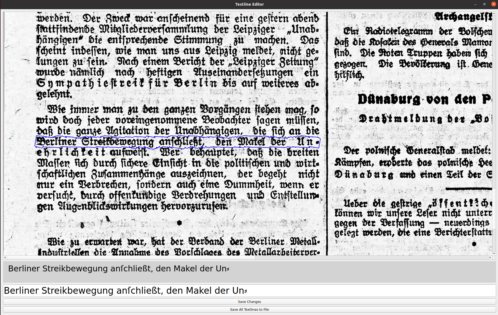

# OCR_textline_editor
OCR_textline_editor is a Python-based tool that helps users interactively review and edit OCR-predicted text from image-based documents. The tool provides an interface for inspecting textline predictions, 
modifying them as needed, and saving the edits to XML files.



## Features
* Interactive Textline Hover: Hover over an image to view the text content of individual textlines.
* Inline Text Editing: Click on a textline to open an editable text bar for quick modifications.
* Save Changes: Save edits to the loaded session with a single click (`Save Changes` button) or keyboard shortcut (`Ctrl s`).
* Flexible Editing: Resize the editing bar with `Ctrl +` to enlarge or `Ctrl -` to shrink.
* XML File Handling: Save the modified textlines to the original XML file or a new file.

## Installation
1 - Clone the repository:

```
git clone git@github.com:qurator-spk/OCR_textline_editor.git
```

2- Install dependencies:

```
pip install -r requirements.txt
```

## Running the Tool
1-Run the tool:

```
python main.py
```

2- Choose the image and corresponding XML file containing the OCR-predicted results.

3- Interact with the tool:

* Hover over the image to view textline predictions.

* Click on a textline to open the editing bar for modification.

* Save changes with the `Save Changes` button or `Ctrl s`.

* Save all modified textlines to an XML file with the `Save All Textlines to File` button.

